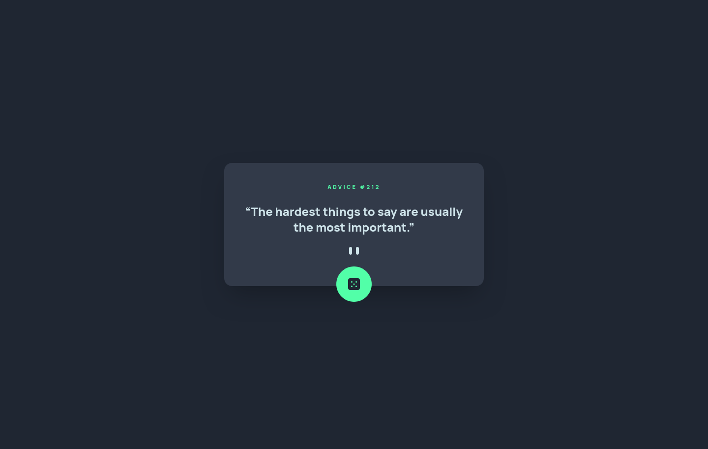

# Frontend Mentor - Advice generator app solution

This is a solution to the [Advice generator app challenge on Frontend Mentor](https://www.frontendmentor.io/challenges/advice-generator-app-QdUG-13db). Frontend Mentor challenges help you improve your coding skills by building realistic projects.

## Table of contents

- [Frontend Mentor - Advice generator app solution](#frontend-mentor---advice-generator-app-solution)
  - [Table of contents](#table-of-contents)
  - [Overview](#overview)
    - [The challenge](#the-challenge)
    - [Screenshot](#screenshot)
    - [Links](#links)
  - [My process](#my-process)
    - [Built with](#built-with)
    - [Continued development](#continued-development)
    - [Useful resources](#useful-resources)
  - [Author](#author)

## Overview

### The challenge

Users should be able to:

- View the optimal layout for the app depending on their device's screen size
- See hover states for all interactive elements on the page
- Generate a new piece of advice by clicking the dice icon

### Screenshot

### Links

- Solution URL: [https://www.frontendmentor.io/solutions/advice-generator-app-using-tailwindcss-and-typescript-24nUGSJ58p](https://www.frontendmentor.io/solutions/advice-generator-app-using-tailwindcss-and-typescript-24nUGSJ58p)
- Live Site URL: [https://tubular-parfait-6a20e7.netlify.app/](https://tubular-parfait-6a20e7.netlify.app/)

## My process

### Built with

- Semantic HTML5 markup
- Flexbox
- Mobile-first workflow
- [Parcel](https://parceljs.org/) - Build Tool
- [Tailwindcss](https://tailwindcss.com/) - CSS Framework

### Continued development

I think I've done enough projects with Vanilla Typescript. Going forward I'm going to focus on building projects using JS Frameworks like Vue or Solid unless the project doesn't require much if any JS at all.

### Useful resources

- [Fetch API](https://developer.mozilla.org/en-US/docs/Web/API/Fetch_API/Using_Fetch) - Helped me brush-up on the Fetch API

## Author

- Frontend Mentor - [@ArthurWiliams](https://www.frontendmentor.io/profile/ArthurWiliams)
